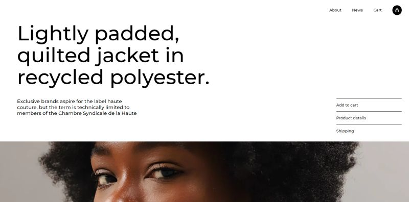

# Shop Jacket: Modern Hero Section Design

This repository contains the code for a single-page website showcasing a modern and professional hero section design. The design utilizes a black and white color scheme to create a clean and impactful aesthetic.

## Design Overview

This project focuses on implementing a visually appealing and engaging hero section using a minimalist design approach. Key elements include:

* **Clean and Modern Layout:** The hero section features a well-structured layout with clear visual hierarchy.
* **Black and White Theme:** The use of black and white colors creates a sense of sophistication and focus, highlighting the product.
* **Responsive Design:** The website adapts seamlessly to different screen sizes, ensuring a consistent user experience across devices.
* **Interactive Elements:** Interactive elements like "Add to cart," "Product details," and "Shipping" links provide users with clear next steps and enhance the user experience.